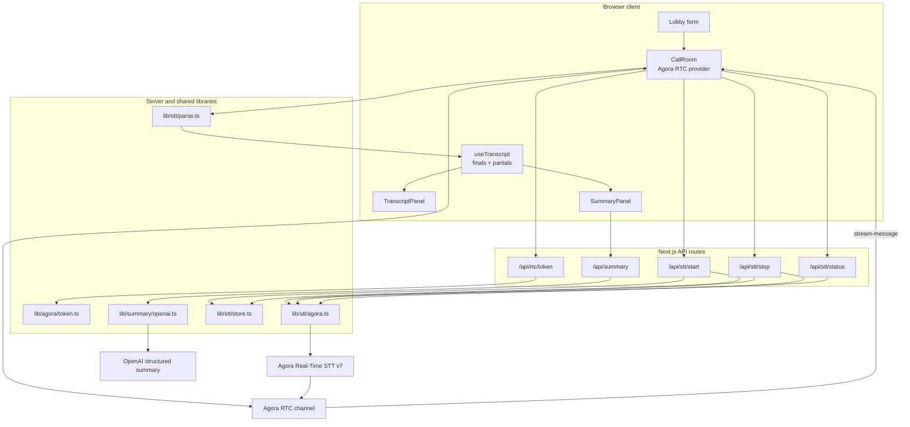
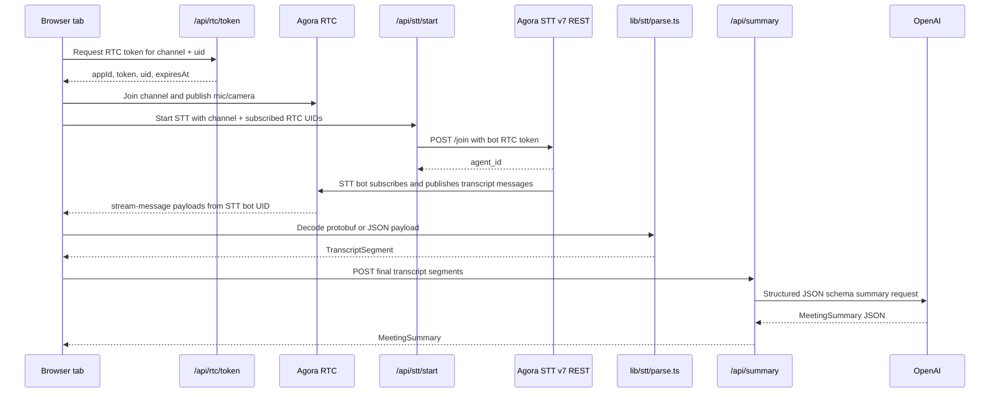
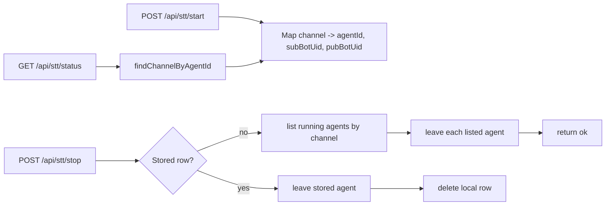
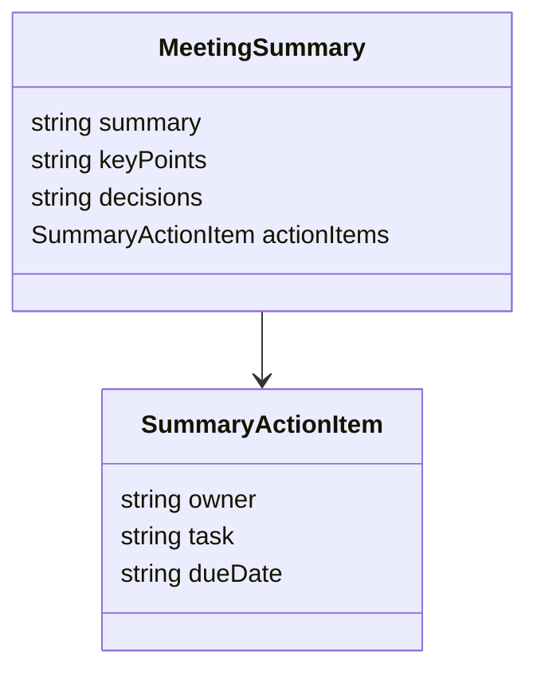

# Architecture

This app is intentionally small: one Next.js App Router page, thin API routes, and provider logic isolated under `lib/`.

## System Overview

## Runtime Data Flow

## Server State

The in-memory store is acceptable for a local demo because the app runs in one Node process. In production it should move to Redis or a database and include ownership/expiration semantics.

## Summary Contract

The API returns the same shape for normal and empty transcript cases. Malformed requests return non-2xx JSON with an `error` field.
