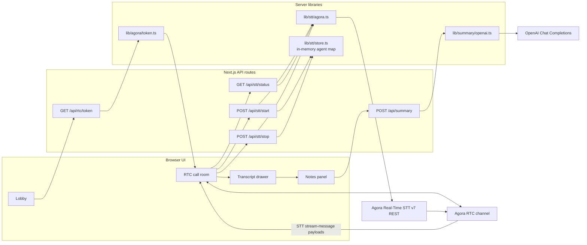
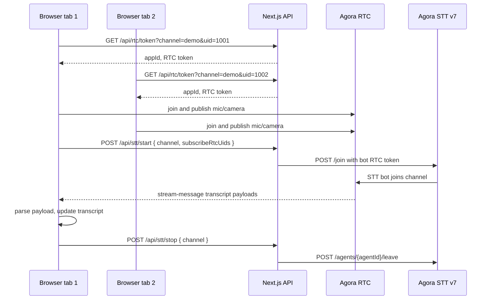
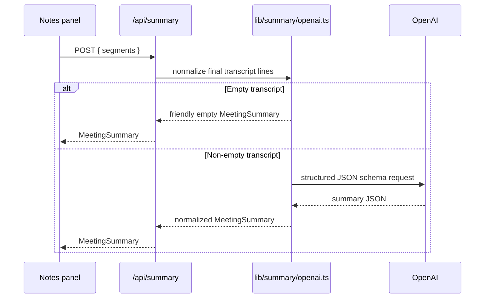

# Agora RTC + STT + AI Summary Demo

Next.js app that connects two browser tabs into an Agora video call, starts Agora Real-Time STT for the call, displays a live transcript, and generates structured meeting notes from the transcript.

## What Works

- Two browser tabs can join the same Agora RTC channel with mic and camera.
- Server-side RTC token generation keeps the Agora app certificate off the client.
- Agora Real-Time STT v7 can be started and stopped from the call UI.
- STT bot messages are filtered out of the participant grid and parsed from RTC `stream-message` events.
- Transcript lines render live in a drawer.
- The Notes panel generates structured meeting notes:
  - Summary
  - Key points
  - Decisions
  - Action items with optional owner and due date

## Quick Start

```bash
npm install
cp .env.local.example .env.local
npm run dev
```

Open the local URL printed by Next.js, usually:

```text
http://localhost:3000
```

Fill `.env.local` before using the API routes:

```bash
# Agora RTC token generation
AGORA_APP_ID=
AGORA_APP_CERTIFICATE=

# Agora Real-Time STT v7 REST
AGORA_CUSTOMER_KEY=
AGORA_CUSTOMER_SECRET=
AGORA_STT_REGION=global

# Meeting summary
OPENAI_API_KEY=
```

`AGORA_STT_REGION` may be `global`, `default`, a region such as `ap-southeast-1`, or a full `https://...` Agora REST host if your account requires one.

**Where to get credentials**

- **Agora** — [https://console.agora.io/](https://console.agora.io/): project **App ID** and **primary certificate** for RTC tokens; enable **Real-Time STT** and create or copy **RESTful API** customer **key** and **secret** for `AGORA_CUSTOMER_KEY` / `AGORA_CUSTOMER_SECRET`
- **OpenAI** — [https://platform.openai.com/](https://platform.openai.com/): create an **API key** for `OPENAI_API_KEY` (billing / usage limits apply per your OpenAI account).

## Demo Flow

### [Demo video link](https://youtu.be/ZcQgJ19Q3Gs?si=4zngMimG3mkT2Awf)


Use one computer with two tabs for the most reliable demo. A tunnel is not required.

1. Start the app with `npm run dev`.
2. Open two tabs to the same local URL.
3. In tab 1, join channel `demo` with UID `1001`.
4. In tab 2, join channel `demo` with UID `1002`.
5. Use headphones and mute the inactive tab's mic to reduce echo.
6. Click **Start transcription** in one tab.
7. Speak a short scripted conversation.
8. Open **Transcript** and confirm transcript lines appear.
9. Click **Stop transcription**.
10. Click **Generate** in the **Notes** panel.
11. Confirm structured notes render.

Suggested demo script:

```text
User 1001:
We are preparing for the team meeting on Friday.
The decision is: use the simple slide deck.
Do not use the long slide deck.
I will update the agenda tomorrow.
The main risk is not enough time for questions.

User 1002:
I will create the calendar invitation today.
I will collect team questions before Friday.
Please add one final slide after the agenda is done.
The final slide has no owner yet.
```

## Architecture

For more detail, see [ARCHITECTURE.md](./ARCHITECTURE.md). For implementation approach, AI usage, tradeoffs, and debugging notes, see [WRITEUP.md](./WRITEUP.md).



## STT Sequence



## Summary Sequence



## Project Structure

```text
app/
  api/rtc/token/route.ts      RTC token route
  api/stt/*/route.ts          STT start/status/stop routes
  api/summary/route.ts        Meeting summary route
  page.tsx                    Single-page app shell
components/
  Lobby.tsx                   Channel and UID form
  CallRoom.tsx                RTC, STT controls, transcript and summary wiring
  TranscriptPanel.tsx         Live transcript UI
  SummaryPanel.tsx            Structured notes UI
  VideoTile.tsx               Local and remote video tiles
hooks/
  useTranscript.ts            Final and partial transcript state
lib/
  agora/                      RTC client and token helpers
  stt/                        Agora STT REST client, parser, state store
  summary/                    Summary types and OpenAI helper
scripts/
  stt-parse-smoke.ts          Offline parser smoke test
WRITEUP.md                    Implementation approach and tradeoffs
ARCHITECTURE.md               Additional Mermaid architecture diagrams
```

## Scripts

| Command | Purpose |
| --- | --- |
| `npm run dev` | Start the local Next.js dev server |
| `npm run build` | Production build |
| `npm run start` | Serve a production build |
| `npm run typecheck` | Run TypeScript checks |
| `npm test` | Run the STT parser smoke test via `npx --yes tsx scripts/stt-parse-smoke.ts` |

Note: `tsx` is intentionally not committed as a project dependency. On a fresh machine, `npm test` may need network access so `npx` can download the runner, unless it is already cached.

## Known Gaps And Improvements

- STT agent state is an in-memory `Map`, so it assumes a single server process. Production should use Redis or a database.
- The app does not implement v7 `update`, so if a participant joins after STT starts, the bot may not subscribe to that late user.
- Transcript quality depends heavily on mic setup, echo, and Agora STT recognition. A production system should add keyword hints, audio-quality checks, and better transcript post-processing.
- Transcript fragments are displayed as finalized STT segments. Merging nearby final fragments into sentence-like blocks would improve summary input.
- There is no auth, persistence, deployment hardening, or token refresh.

## Verification Performed

```bash
npm run typecheck
npm test
npm run build
```

`npm run typecheck` and `npm test` were re-run during final review. `npm test` completed with `stt-parse-smoke: ok`.

The summary route was also checked with mocked transcript payloads for malformed, empty, partial-only, and normal two-speaker transcripts.
