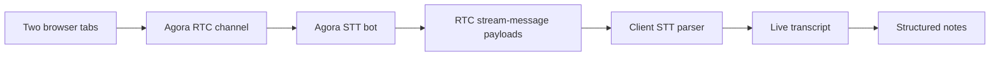
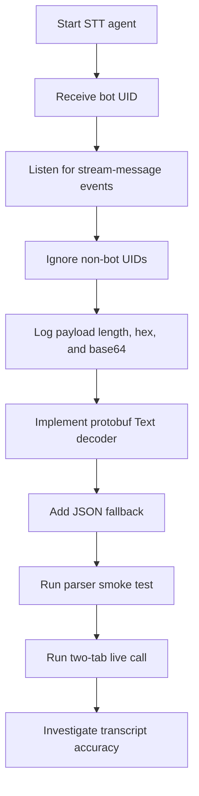

# Writeup

## Overall Implementation Approach

I built a small Next.js App Router demo around one end-to-end flow: two browser tabs join an Agora RTC call, Agora Real-Time STT transcribes the call, and an OpenAI summary route turns the transcript into structured meeting notes.

Before writing code, I used Opus 4.7 to sketch the problem in `docs/FRAMEWORK.md` as inputs, outputs, entities, flow, assumptions, and explicit skips. That helped separate the required demo path from nice-to-have work. I then converted that framework into `PLAN.md`, which broke the build into shippable checkpoints.

The application is split into thin API routes and focused helper modules:

- `app/api/rtc/token/route.ts` generates Agora RTC tokens on the server.
- `app/api/stt/*/route.ts` starts, checks, and stops Agora Real-Time STT v7 agents.
- `app/api/summary/route.ts` validates transcript segments and returns structured notes.
- `lib/agora/*` contains RTC client/token helpers.
- `lib/stt/*` contains Agora STT REST calls, in-memory agent state, payload parsing, and channel validation.
- `lib/summary/*` contains the `MeetingSummary` contract and OpenAI structured-output call.
- `components/*` contains the lobby, call room, video tiles, transcript drawer, and notes panel.

The implementation was intentionally checkpoint-driven:

1. Scaffold the Next.js TypeScript app and runtime env validation.
2. Add server-side RTC token generation.
3. Build two-tab RTC join/leave with local and remote video.
4. Add Agora Real-Time STT v7 start/status/stop routes.
5. Log raw STT `stream-message` payloads before committing to parser assumptions.
6. Parse protobuf/JSON STT payloads and render live transcript lines.
7. Add a structured summary route and Notes UI.
8. Finish README, architecture diagrams, writeup, and demo guidance.

## AI Tools Used

I used Opus 4.7 first to create `docs/FRAMEWORK.md`, an initial problem decomposition covering inputs, outputs, entities, flow, assumptions, and what to skip. After that, I used Composer 2 to execute individual checkpoints from `PLAN.md` using the implementation/verification prompt captured in `docs/4_CHECKPOINT_IMPLEMENT_VERIFY.md`. I used GPT-5.5 for checkpoint review with the review prompt captured in `docs/5_REVIEW_DIFF.md`. I used Codex as the primary assistant in this final pass to inspect the repo, edit code/docs, run local verification, reason through Agora STT behavior, and produce the final README/WRITEUP/architecture docs.

I also used AI as a planning and review partner: first to break the project into checkpoints, then to break the summary feature into quality gates, and later to investigate transcript accuracy without immediately changing code.

## Representative Prompts

These are representative prompts from the development process:

1. "How far am I in the plan?"
2. "To do step 7, do I need to mock results of a conversation between 2 users to create a good summary at first?"
3. "You are senior engineer - what are other steps to make sure that step 7 is done with high quality?"
4. "Execute the recommended order as senior engineer."
5. "You are senior engineer - do not change code - investigate the issues with transcript accuracy."
6. "Do Checkpoint 8 as senior engineer, include architecture diagrams as Mermaid diagrams so they can render well on markdown."

Earlier implementation prompts also focused on the core build:

- Sketch this take-home exercise as inputs, outputs, entities, flow, assumptions, and what to skip.
- Follow `CLAUDE.md` and implement only this checkpoint from `PLAN.md`; before editing, state the goal, smallest safe fix, and expected files; after editing, run the smallest useful verification and report files changed, constraints preserved, verification, and remaining risks.
- Review the current working tree against `PLAN.md` for this checkpoint only; inspect plan, status, diff, and report must-fix issues only with file/line references.
- Build a minimal Next.js App Router demo for Agora RTC, Real-Time STT, and AI meeting notes.
- Keep API routes thin and move business logic into `lib/`.
- Confirm the Agora STT v7 REST flow and avoid older builder-token assumptions.
- Inspect raw STT stream-message payloads before writing the parser.

## Where AI Helped

AI helped most in five places:

1. **Project decomposition**  
   Opus 4.7 helped create the initial `docs/FRAMEWORK.md` decomposition, and Codex helped turn that into the more actionable `PLAN.md` checkpoints that could be verified independently.

2. **Checkpoint execution discipline**  
   Composer 2 followed the checkpoint implementation prompt in `docs/4_CHECKPOINT_IMPLEMENT_VERIFY.md`, which kept each implementation pass scoped to one checkpoint and forced a small verification step before moving on.

3. **Review discipline**  
   GPT-5.5 followed the review prompt in `docs/5_REVIEW_DIFF.md`, checking each checkpoint diff against `PLAN.md` and focusing on must-fix issues, missing files, scope creep, and API/data-shape regressions.

4. **Agora STT integration**  
   It helped distinguish the Agora Real-Time STT v7 REST flow from older docs and examples. The final implementation uses v7 `join`, `get`, `leave`, and `list` with HTTP Basic Auth.

5. **Payload parsing strategy**  
   It helped identify that STT transcripts arrive in the browser as RTC `stream-message` payloads from the STT bot, not as a server callback. That led to the raw payload logging checkpoint and the isolated parser in `lib/stt/parse.ts`.

6. **Summary quality gates**  
   It helped break the summary feature into a stable contract, input validation, empty-state behavior, structured OpenAI output, fixture testing, UI states, and live end-to-end verification.

7. **Demo and documentation**  
   It helped produce concise demo scripts, identify STT-friendly phrasing, and document architecture/tradeoffs with Mermaid diagrams.

## Where AI Was Incorrect Or Incomplete

The main incorrect or incomplete area was **Agora STT version confusion**. The initial `docs/FRAMEWORK.md` still assumed a builder-token style STT flow, and some older reference material pointed in the same direction. That did not match the target implementation. The correction in `PLAN.md` and the code was to use Agora Real-Time STT v7 REST:

- HTTP Basic Auth with `AGORA_CUSTOMER_KEY` and `AGORA_CUSTOMER_SECRET`
- `POST /join` to start an agent
- `GET /agents/{agentId}` for status
- `POST /agents/{agentId}/leave` to stop
- `GET /agents?channel=&state=2` to recover and stop agents if local state was lost

AI was also incomplete when reasoning about transcript quality. It initially seemed plausible that a stronger summary model could compensate for bad transcript text. After live tests, the better conclusion was that most visible errors came from upstream STT recognition and audio setup. A summary model can smooth notes, but it cannot reliably recover words that Agora STT misheard.

The practical correction was to keep the summary implementation stable, investigate the STT/audio path separately, and use a cleaner demo script with simpler words.

## Major Technical Issue And Investigation

The biggest technical issue was getting reliable transcript text from Agora Real-Time STT.

The server starts the STT agent, but transcript data does not return to the server directly. The STT bot joins the Agora RTC channel and publishes transcript data to the browser through RTC `stream-message` events. That meant the browser needed to:

1. Know the STT bot UID returned from `/api/stt/start`.
2. Filter stream messages so only bot messages are parsed.
3. Inspect the raw payload shape in development.
4. Parse Agora's protobuf `Text` payload, with a JSON fallback.
5. Merge final and partial transcript segments for display.

Investigation flow:

The first part was resolved by isolating STT parsing in `lib/stt/parse.ts` and verifying it with `scripts/stt-parse-smoke.ts`.

The second part was transcript accuracy. Live tests showed errors such as:

- "send the calendar invite" becoming "sign the calendar invite"
- technical phrases such as README, Redis, and STT payload being misheard
- noisy fragments when switching between two local tabs

The investigation found that this was not primarily a summary-model bug. The transcript was already noisy before summary generation. Likely causes were two local browser tabs, mic/speaker echo, quick speech, filler words, and domain-specific vocabulary.

Mitigations used for the final demo:

- Use headphones.
- Mute the inactive tab.
- Speak short sentences with pauses.
- Avoid technical jargon in the spoken script.
- Say explicit decision phrases such as "The decision is..."
- Use a simple meeting topic instead of STT/Redis/README-heavy wording.

Production improvements would include Agora STT keyword hints, better audio/device guidance, sentence-level transcript post-processing, late-joiner subscription updates, and possibly a stronger or domain-adapted STT system.

## Current Status

The demo currently supports:

- Two-tab Agora RTC video calling.
- Server-side RTC token generation.
- Agora Real-Time STT start/stop/status.
- Live transcript rendering.
- Structured meeting notes from transcript segments.
- Markdown documentation with Mermaid architecture diagrams.

Remaining limitations:

- STT agent state is in memory.
- Late joiners are not handled with STT v7 `update`.
- Transcript quality depends on the user's mic setup and Agora STT recognition.
- The demo video is still an external deliverable to record and attach.
